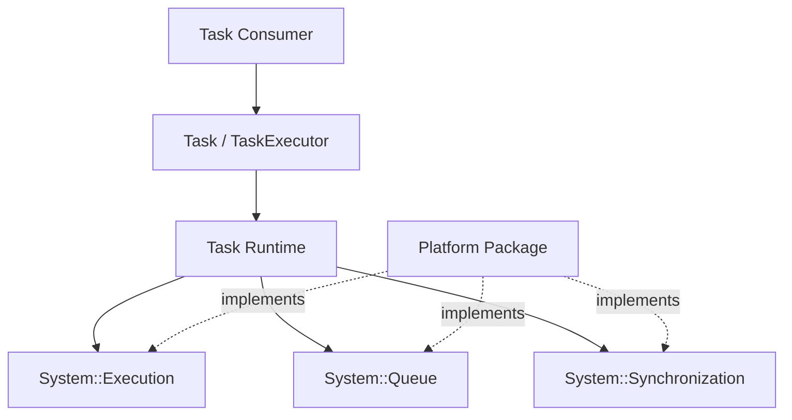

# Extension Architecture

ESPressio Task sits above primitive System execution, queue, and synchronization capabilities. Extensions should preserve that separation.

## What belongs in Task

Task owns discrete-work lifecycle, bounded-work semantics, saturation policy, work statistics, and adaptation of System primitives into an asynchronous work abstraction.

## What does not belong in Task

Native RTOS task handles, queues, semaphores, processor APIs, and target-specific stack allocation remain below ESPressio System/provider boundaries.

Higher-level autonomous worker lifecycles belong in ESPressio Threads.

## Extension rule

When adding capability, prefer extending the portable Task abstraction only when the concept is meaningful to all Task consumers. Target-specific capability belongs in the platform provider layer.