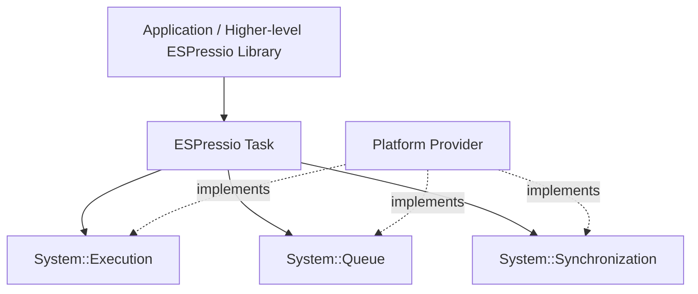

# ESPressio Task

> Documentation baseline: **1.0.0**

ESPressio Task provides bounded asynchronous execution primitives for the ESPressio Development Platform.

It is deliberately distinct from ESPressio Threads:

- **Task** represents discrete asynchronous work.
- **TaskExecutor** is a persistent bounded worker that executes many discrete work items without allocating a new execution context for every message.
- **Threads** is the higher-level lifecycle abstraction for long-lived autonomous workers.

## Choose your documentation path

### Using the library

- [Getting Started](Getting-Started)
- [TaskExecutor](TaskExecutor)
- [One-Shot Tasks](One-Shot-Tasks)
- [Lifecycle](Lifecycle)
- [Queue Saturation](Queue-Saturation)
- [Configuration and Affinity](Configuration-and-Affinity)
- [Statistics and Stack Telemetry](Statistics-and-Stack-Telemetry)
- [Choosing Task or Threads](Choosing-Task-or-Threads)

### Extending the library

- [Extension Architecture](Extension-Architecture)
- [Runtime Abstraction](Runtime-Abstraction)
- [Work Item Contracts](Work-Item-Contracts)
- [Platform Integration](Platform-Integration)
- [Testing Task Extensions](Testing-Task-Extensions)

## Architectural position

Task does not expose native RTOS handles or depend directly on ESP32/FreeRTOS.